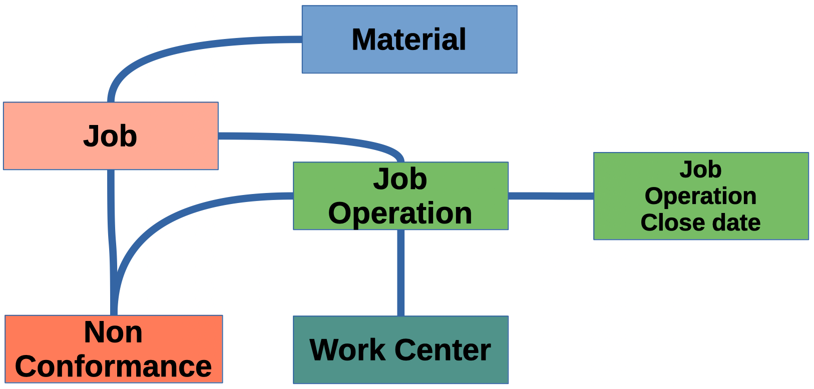

# CMPSC529-01

Internship: Computer Science

Semester: Fall 2024

## Instructor

Dr. Oliver Bonham-Carter (Note: said and written as __Bonham-Carter__, not _Cart
er_)

- Office Location: Alden Hall 203
- Email: <obonhamcarter@allegheny.edu>

This repository contains an archive of materials for the course.

## Resources

### Data

The data for the project is available in `csv` format, as well as in a locally created SQLite3 data base. Check back here to find updates as they become available.

+ Data is located in a [Google Drive](https://drive.google.com/drive/folders/1A2rw5fk-xLNoEfMWpfYtPtoRG5OAd07o?usp=drive_link)

### Methods

Here we list URLs to resources for method-related aspects of the project.

- <a href="https://neo4j.com/" target="_blank">Neo4j</a>
- <a href="https://neo4j.com/" target="_blank">[Tutorials Overview](https://neo4j.com/docs/getting-started/appendix/tutorials/tutorials-overview/)</a>
  - Tutorial: Import data from a relational database into Neo4j using 
  <a href="https://neo4j.com/docs/getting-started/appendix/tutorials/guide-import-relational-and-etl/" target="_blank">Cypher</a>
  
  